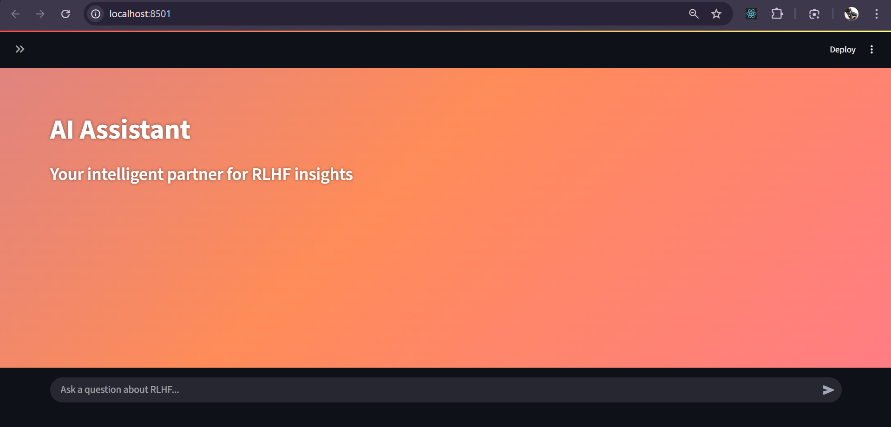
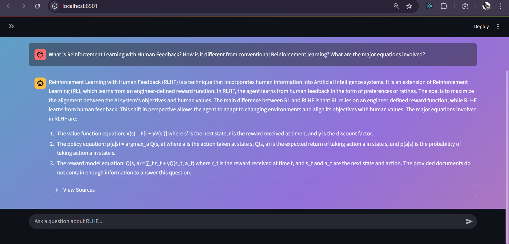

# RAG-based LLAMA Chatbot

A Retrieval-Augmented Generation (RAG) powered chatbot built using the **LangChain Orchestration Framework** and **open-source Hugging Face LLAMA models**. The system supports document-grounded Q\&A, where you can replace the dataset with your own PDFs and interact via a **Streamlit web app**.

---

## Repository Structure

```
├── app/
│   └── app.py              # Streamlit frontend UI
├── assets/
│   ├── entry-page.png      # Screenshot of the welcome screen
│   └── qa-page.png         # Screenshot of a Q&A interaction
├── data/
│   └── (Your PDFs here)    # Place your source documents in this folder
├── rag_pipeline/
│   └── chain.py            # Core backend RAG logic and model loading
├── vectorstore/
│   └── (Generated DB)      # FAISS vector index after ingest.py
├── .gitignore
├── ingest.py               # Script to build the vector database
├── requirements.txt        # Python dependencies
└── README.md               # You are here!
```

---

## Features

* Retrieval-Augmented chatbot with LLAMA-based embeddings and text generation.
* Pluggable dataset — replace `data/` with your own PDFs.
* Vector database generation using FAISS.
* Streamlit-powered web interface for easy interaction.

---

## Setup Instructions

### Clone the Repository

```bash
git clone https://github.com/Gautam-sudo-bits/RAG-Llama-chatbot.git
cd RAG-Llama-chatbot
```

### Install Dependencies

```bash
pip install -r requirements.txt
```

### Add Your Documents

* Place your **PDFs or text documents** inside the `data/` folder.

### Build the Vector Store

```bash
python ingest.py
```

This step creates the FAISS vector index inside `vectorstore/`.

### Launch the Streamlit App

```bash
streamlit run app/app.py
```

**On successful run, you should see the entry page:**



### Chat with Your Documents

Type your question in the chat box. The chatbot retrieves relevant chunks from your documents and generates an answer.

 **Example Q\&A interaction:**



---

## Tech Stack

* **LangChain Orchestration Framework**
* **LLAMA-based Hugging Face models**
* **FAISS** for vector search
* **Streamlit** for frontend
* **Python 3.9+**

---

## Notes

* Ensure you have **Python 3.9+** installed.
* Replace `data/` contents with your own files to customize the knowledge base.
* Rerun `ingest.py` every time you update your documents.

---

## License

This project is open-source under the MIT License.
